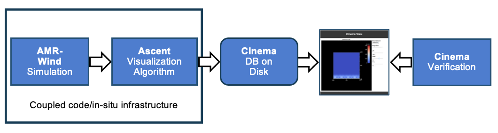
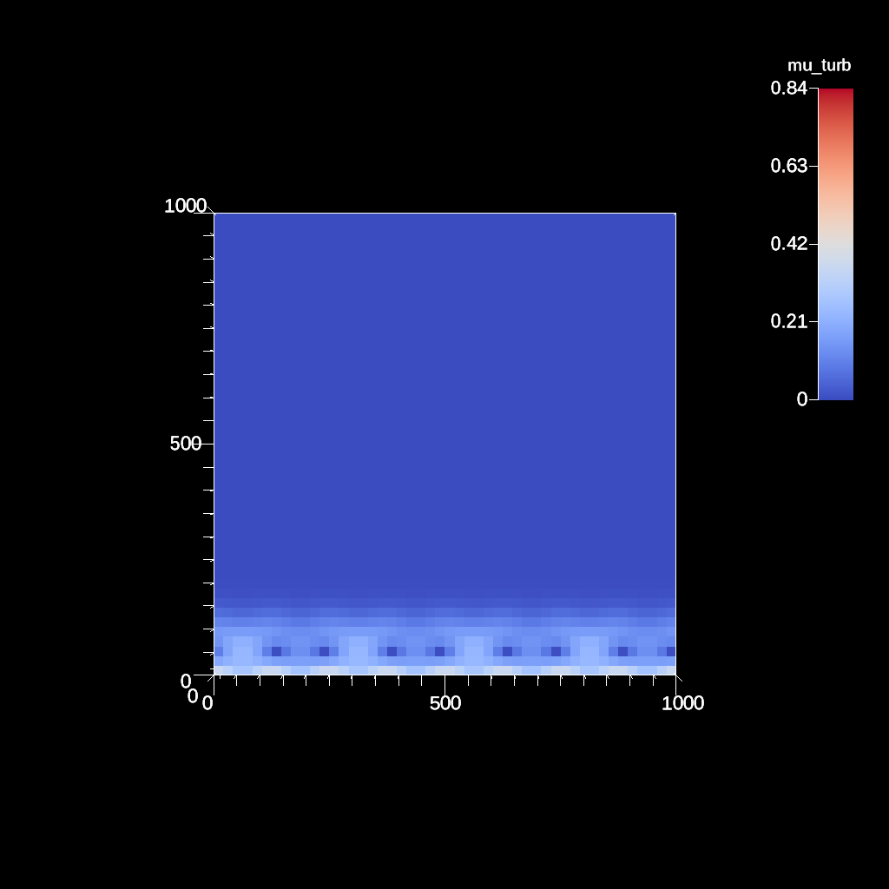
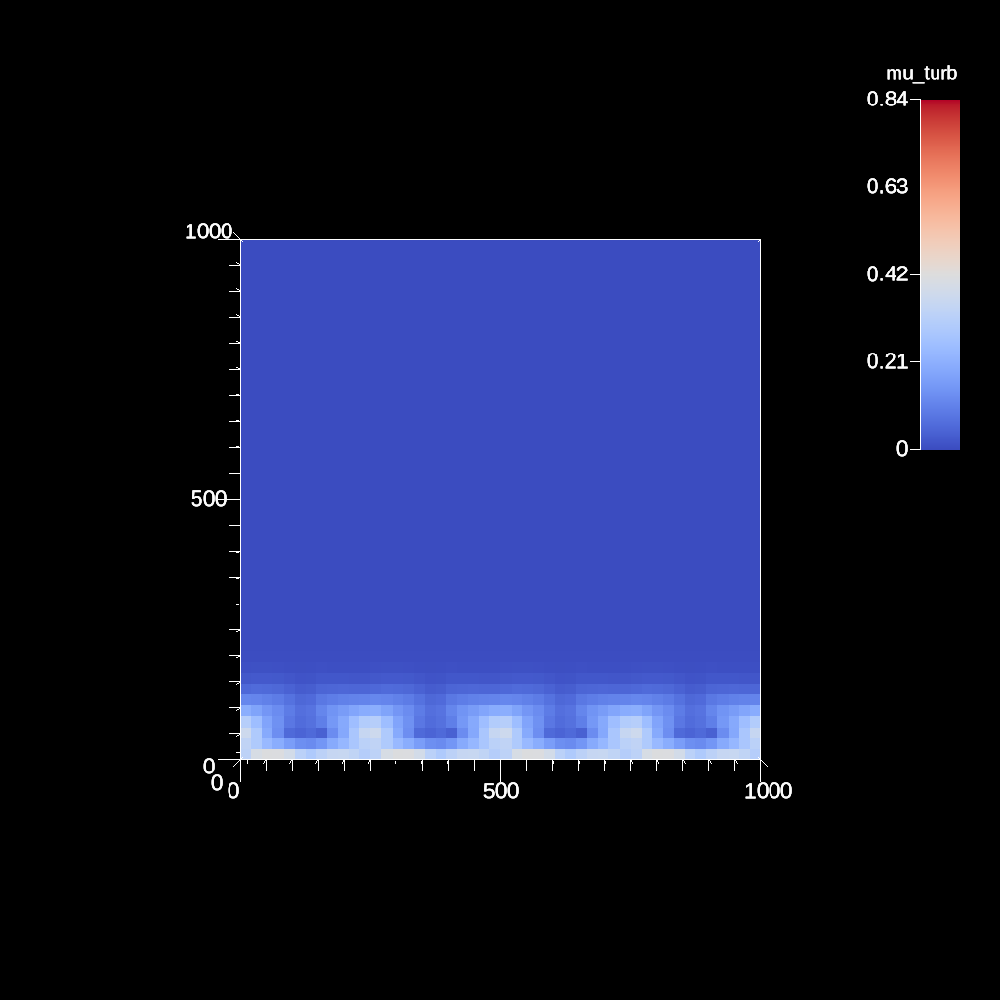
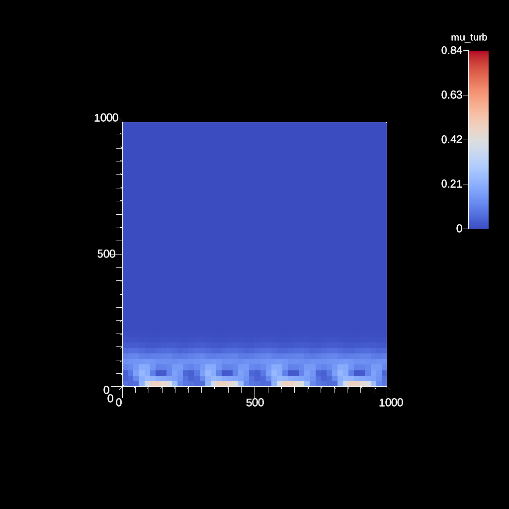

# ExaWind AMR-Wind workflow with in-situ visualization using Ascent

    

Diagram of workflow in this example.

A repository for examples using `ExaWind-AMRWind` and `Ascent` for creation of `Cinema` databases.

Instructions for building Exawind-AMRWind with Ascent can be found [here](https://github.com/Alpine-DAV/ascent/wiki/Building-AMRWind). These instructions were adapted into custom Spack package files.

This workflow will pull cached builds from a [E4S](https://e4s-project.github.io/) repository. The embedded example run is derived from a regression test, and can be found in the Alpine-DAV AMRWind source [here](https://github.com/Alpine-DAV/amr-wind/tree/ascent/test/test_files/abl_godunov).

<table>
<tr>
<td>
<td>
<td>
</tr>
</table>

Images from the resulting Cinema database (used to validate run)

The workflow does the following:

- Creates a [Pantheon](http://pantheonscience.org/) environment and build location
- Clones a specific commit of [Spack](https://github.com/spack/spack)
- Uses `spack` to build [ExaWind-AMRWind](https://amr-wind.readthedocs.io/en/latest/)
- Runs a regression test, and produces a `Cinema` database in-situ with [Ascent](https://ascent.readthedocs.io/en/latest/)
- Installs a `Cinema` viewer, then packages up the results
- Validates the `Cinema` database

## Using this repository

First, clone the repository, then:
- Edit the bootstrap.env file to include your compute allocation ID and the base path where installs and results should go.
- Execute the workflow by typing ./execute. Take a look at this file to see the steps that are executed, and where to look for more detail.

